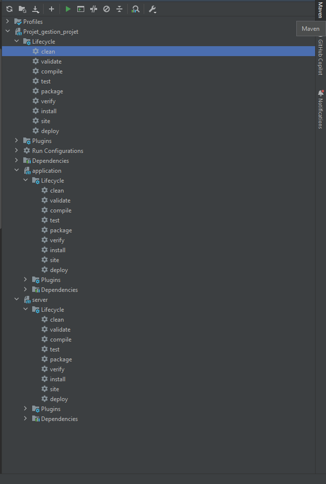

# Informations

Ce document présente plusieurs informations concernant le projet.
Il détaille la version java, la compilation à l'aide de Maven et l'exécution.

## 1. Version java

Le projet est codé et compilé sous la version Java 19.

## 2. Compilation

Ce projet utilise l'outil de compilation Maven. 
Pour obtenir une version exécutable du logiciel et du serveur à partir du code source,
il faudra exécuter 2 tâches de Maven: 'clean' et 'install'.

La tâche 'clean' permet de nettoyer tous les fichiers générés lors de la compilation,
tandis que la tâche 'install' va générer les exécutables.

L'exécution de ces 2 tâches peut être faite selon 3 façons:

### a) Via la vue Maven d'intelliJ (manuel)

IntelliJ offre une vue des actions possible avec Maven.
Pour l'ouvrir, cliquez sur l'onglet "Maven" à droite de l'écran.  
Déroulez l'onglet 'Projet_gestion_projet' puis 'Lifecycle'
Lancez la commande 'clean'. Cette dernière permet de nettoyer les fichiers générés lors de la compilation. 
Ensuite, cliquez sur 'install'

Il est important de faire cette opération sous l'onglet 'Projet_gestion_projet'
et non sous les onglets 'server' et 'application' 
qui génèreront uniquement respectivement le serveur et le logiciel.



### b) Via les commandes 'mvn' (manuel)

Ouvrez un terminal à la racine du projet.  
lancez la commande suivante :

```
mvn clean install
```

Cette commande exécute la tâche 'clean' et la tâche 'install'

### c) Via l'outil 'Run/Debug configuration' d'IntelliJ (automatisé)

Dans intelliJ, ouvrez le menu déroulant des configurations.


Sélectionnez 'Edit configuration'.
Cliquez sur le '+' et sélectionnez 'Maven'.
Vous pouvez choisir un nom pour votre configuration.
Dans le champ 'Run', insérez la commande suivante:

```
clean install
```

sélectionnez 'Apply' pour sauvegarder les changements et fermez la fenêtre.
La configuration peut désormais être sélectionnée puis lancée via le bouton 'Run' d'intelliJ
qui se juste à coté du menu déroulant.


## 3. Exécution

Une fois les 2 tâches maven exécutées, les deux exécutables se trouvent dans le dossier 'dist'
sous le format suivant:

``${nom}-Iteration-${version du projet}.jar``

Les fichiers générés sont des exécutables .jar classiques.
Il n'y a pas besoin de faire de manipulations supplémentaires avec Maven.
Ces derniers peuvent donc être exécutés par la JVM.