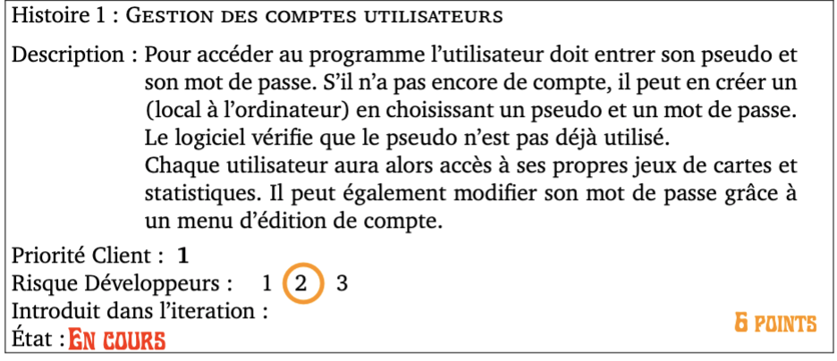
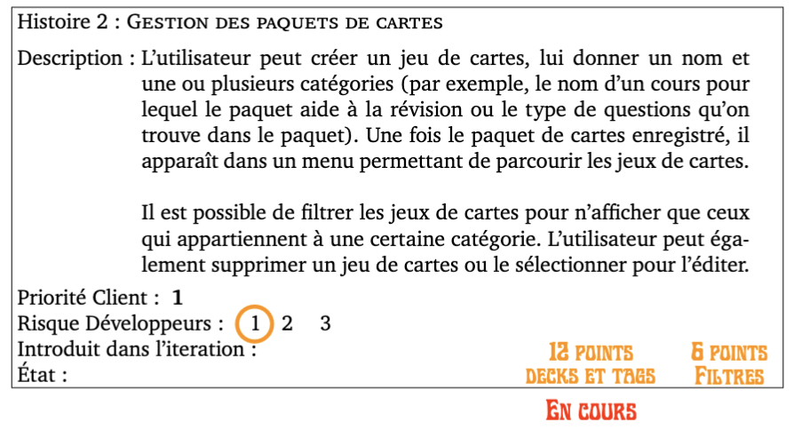
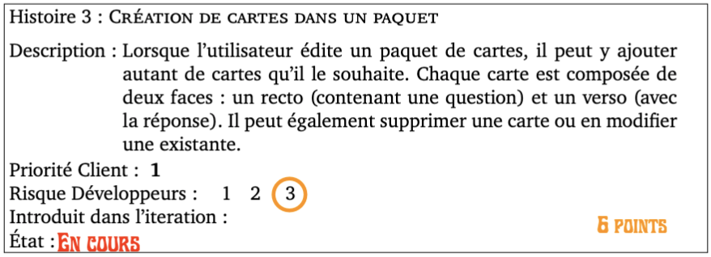

Histoires de l'itération 1
=========================

Les histoires, dont les précisions ont été discutées avec le client, sélectionnées pour cette itération, sont les suivantes : 

# Histoire 1 :

Modification pseudo et mot de passe (mdp), sans remettre son mdp une fois que l'utilisateur est connecté.

* Points : 6
* Risque : 2 
* Priorité : 1
    

# Histoire 2 :

L'histoire a été séparée en 2 parties:

a) Gestion des paquets de cartes et des tags (catégories).
	* Points : 12
b) Filtres (pas pour cette itération)
	* Points : 6
* Risque : 1 
* Priorité : 1

# Histoire 3 :

Voir combien de cartes sont présents dans le paquet, pouvoir ajouter, supprimer ou modifier une carte, avoir une question au recto et une réponse au verso. 

* Priorité : 1
* Risque : 3
* Points : 6

# Histoire 23 : (Ajouté)

Création de l'interface graphique et apprentissage.

* Priorité : 3
* Risque : 3
* Points : 4
