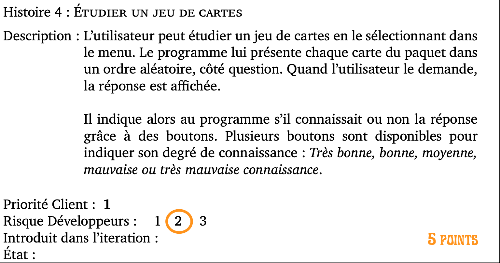
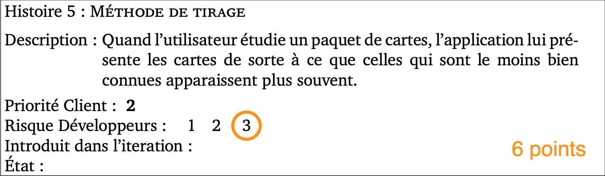

Histoires de l'itération 2
=========================

Les histoires, dont les précisions ont été discutées avec le client, sélectionnées pour cette itération, sont les suivantes :

# Histoire 2 :

Deconnexion + affichage de cartes + boutons pour editer/ajouter et supprimer des cartes

* Points : 6
* Risque : 1
* Priorité : 1

# Histoire 4 :

Classer les cartes selon le degrée de connaissance

* Points : 5
* Risque : 2
* Priorité : 1

# Histoire 5 :

Méthode de tirage :
    -On tire toutes les cartes une fois puis on ne reprend que les cartes non maitrisées

* Priorité : 2
* Risque : 3
* Points : 6

# Histoire 8 :

Nouveaux types paquets :
    -Choix multiples
    -Texte à trous

* Priorité : 2
* Risque : 2
* Points : 9

# Histoire 24 : (Ajouté)

Refactoring

* Priorité : 1
* Risque : 3
* Points : 2
