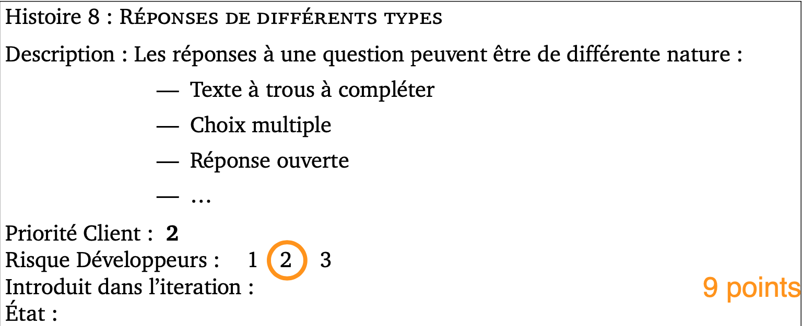
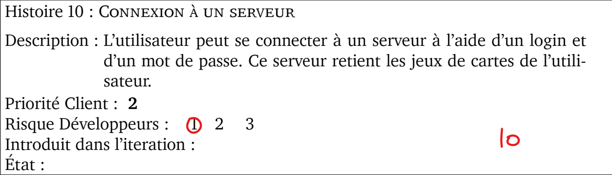
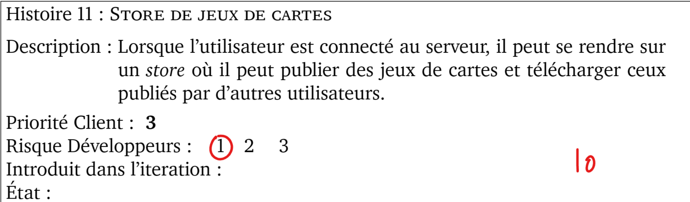
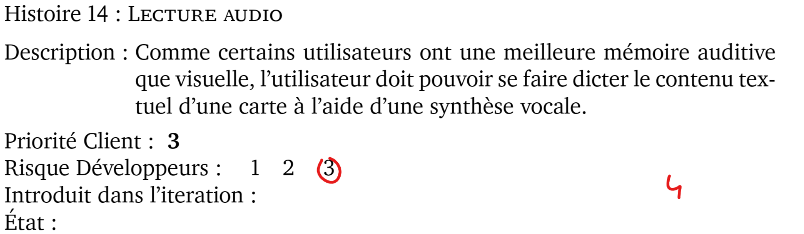

Histoires de l'itération 3
=========================

Les histoires, dont les précisions ont été discutées avec le client, sélectionnées pour cette itération, sont les suivantes :

# Histoire 8 :

Terminer l'implémentation des types de cartes (suite de l'itération 2).

* Points : 4
* Risque : 2
* Priorité : 2

# Histoire 10 :

Connexion à un serveur.

* Points : 10
* Risque : 1
* Priorité : 2

# Histoire 11 :

Création d'un store où l'utilisateur peut publier ses jeux de cartes et en télécharger.

* Points : 10
* Risque : 1
* Priorité : 3

# Histoire 14 :

Création d'une synthèse vocale.

* Points : 4
* Risque : 3
* Priorité : 3

