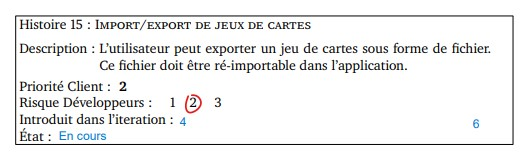
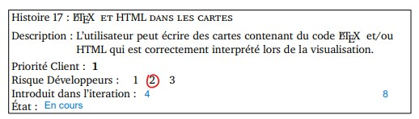

Histoires de l'itération 4
=========================

Les histoires, dont les précisions ont été discutées avec le client, sélectionnées pour cette itération, sont les suivantes :

# Histoire 15 :

Import/Export de jeux de cartes. (Sous format Json)

* Points : 4
* Risque : 2
* Priorité : 2

# Histoire 17:

Implémentation de LATEX et d'HTML dans les cartes. (Lors de l'édition des cartes)

* Points : 8
* Risque : 2
* Priorité : 1

# Histoire 25 :

Terminer le store et réglage des erreurs liées aux serveur et au store.

* Points : 6
* Risque : 2
* Priorité : 1

# Histoire 26 :

Refactoring

* Points : 8
* Risque : 2
* Priorité : 1

# Histoire 27 :

Debug et optimisation du code, de la documentation et des tests.

* Points : 14
* Risque : 3
* Priorité : 1
